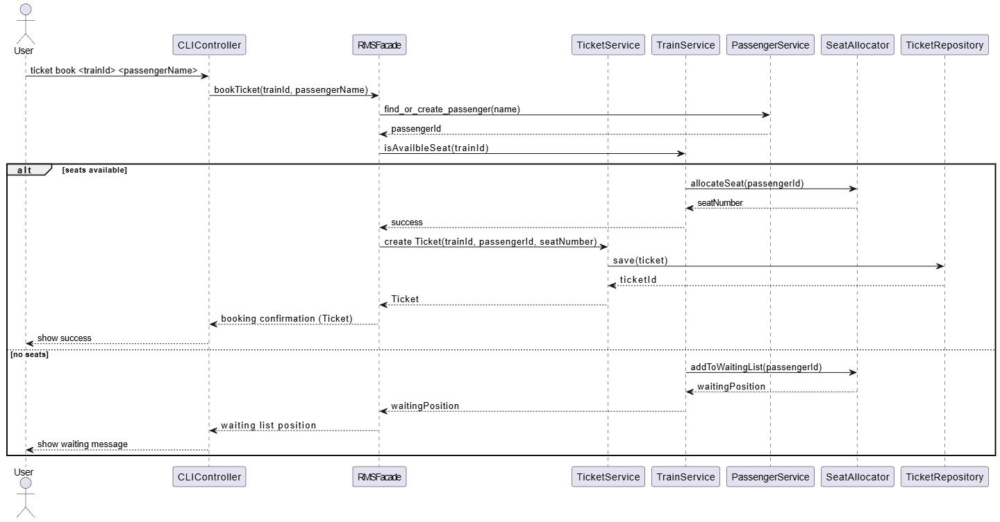
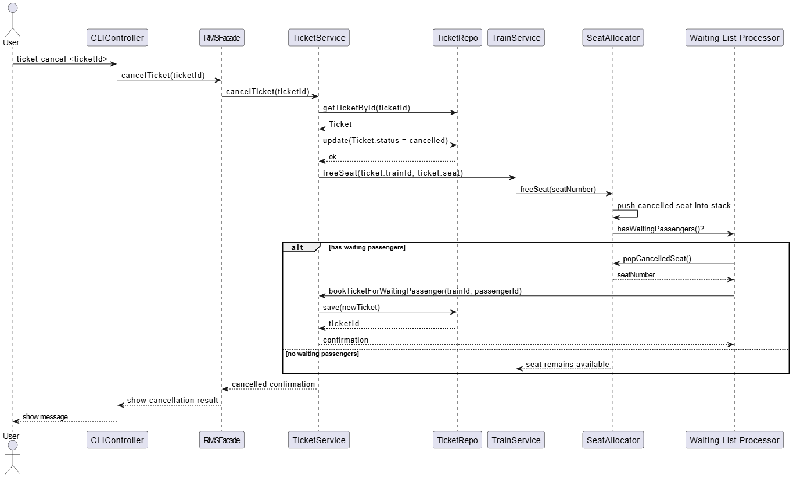

# 🚂 Railway Reservation and Management System (RMS)

> A command-line railway booking system that simulates real-world workflows for trains, passengers, tickets, and dynamic seat allocation using efficient data structures.

---

## Table of Contents

- [🚂 Railway Reservation and Management System (RMS)](#-railway-reservation-and-management-system-rms)
  - [Table of Contents](#table-of-contents)
  - [1. Project Overview](#1-project-overview)
  - [2. Main Objectives](#2-main-objectives)
  - [3. System Features](#3-system-features)
  - [4. Project Architecture](#4-project-architecture)
  - [5. Component Responsibilities](#5-component-responsibilities)
    - [5.1 CLI Layer](#51-cli-layer)
    - [5.2 Command Parsing Layer](#52-command-parsing-layer)
    - [5.3 System Builder](#53-system-builder)
    - [5.4 Facade Layer](#54-facade-layer)
    - [5.5 Service Layer](#55-service-layer)
    - [5.6 Repository Layer](#56-repository-layer)
    - [5.7 Model Layer (Entities)](#57-model-layer-entities)
    - [5.8 Data Structures Layer](#58-data-structures-layer)
    - [5.9 Utility Layer](#59-utility-layer)
  - [6. Project Folder Structure](#6-project-folder-structure)
  - [7. Design Patterns \& SOLID Principles](#7-design-patterns--solid-principles)
    - [Design Patterns](#design-patterns)
    - [SOLID Principles](#solid-principles)
  - [8. Diagrams](#8-diagrams)
  - [9. Build \& Run](#9-build--run)
  - [10. Contributors](#10-contributors)

---

## 1. Project Overview

The **Railway Reservation and Management System (RMS)** is a CLI-based application that manages:

- Trains
- Passengers
- Tickets
- Dynamic seat allocation

It uses **custom data structures** for efficient operations and simulates realistic booking workflows including waiting lists and seat reallocation.

---

## 2. Main Objectives

1. Implement a full railway reservation system using efficient data structures.
2. Manage trains, passengers, tickets, and waiting lists.
3. Optimize search, update, and retrieval using trees, hash tables, vectors, stacks, and queues.
4. Provide realistic booking simulation with seat reallocation and waiting list processing.

---

## 3. System Features

- Add, search, update, and list trains
- Book and cancel tickets
- Manage waiting lists
- Handle seat allocation, reallocation, and recovery
- Add passengers and update records

**Seat Allocation Logic:**

- Seats available → assign immediately
- No seats → add to waiting list
- Seat cancelled → added to recycled stack → assigned to next waiting passenger

---

## 4. Project Architecture

Follows **N-Tier Architecture**:

1. **Presentation Layer**: CLI Layer, Command Parsing Layer
2. **Business/Application Layer**: Facade Layer, Service Layer
3. **Repository Layer**: Data access & storage
4. **Model Layer**: Core entities
5. **Data Structures Layer**: Custom containers

---

## 5. Component Responsibilities

### 5.1 CLI Layer

**`CLIController`**

- Parses commands
- Interacts with `RMSFacade`
- Validates input
- Displays results
- Routes commands → Train / Passenger / Ticket

---

### 5.2 Command Parsing Layer

**`RMSCommand`**

- Converts raw commands to structured enums
- Categorizes commands:

  - Train
  - Passenger
  - Ticket
  - System

---

### 5.3 System Builder

**`StartupManager`**

- Creates repositories & services
- Injects dependencies
- Builds `RMSFacade`

---

### 5.4 Facade Layer

**`RMSFacade`**

- High-level system API
- Delegates to:

  - `TrainService`
  - `PassengerService`
  - `TicketService`

**Benefits**:

- Clean interface
- Decouples UI from logic
- Handles exceptions consistently

---

### 5.5 Service Layer

- **`TrainService`**: CRUD, seat management, train status
- **`PassengerService`**: CRUD, validation, dynamic retrieval
- **`TicketService`**: Booking, cancellation, seat/waiting list management

---

### 5.6 Repository Layer

- **Interfaces**: `ITrainRepository`, `IPassengerRepository`, `ITicketRepository`
- **In-Memory Implementations**: `InMemoryTrainRepository`, etc.
- Responsibilities:

  - Store/retrieve objects
  - Manage IDs
  - Provide clean APIs

---

### 5.7 Model Layer (Entities)

- **Train**: id, name, totalSeats, SeatAllocator
- **SeatAllocator**: manages seats, waiting list, cancellations
- **Passenger**: id, name
- **Ticket**: id, train id, seat number, passenger info, booking status

---

### 5.8 Data Structures Layer

Custom implementations instead of STL:

- `vector`, `stack`, `map` (AVL), `unordered_map` (hash table), `list`, `minHeap`

**Benefits**:

- Performance control
- Educational demo of DS usage

---

### 5.9 Utility Layer

**`helpers.h`**

- String & integer helpers
- Validation, formatting, parsing
- Used across CLI, services, facade

---

## 6. Project Folder Structure

```
/project-root
├── include/
│   ├── CLIController.h
│   ├── RMSApp.h
│   ├── RMSCommand.h
│   ├── RMSFacade.h
│   ├── StartupManager.h
│   ├── models/
│   ├── Repo/
│   ├── Services/
│   ├── structures/
│   └── utils/
├── src/
├── tests/
└── CMakeLists.txt
```

---

## 7. Design Patterns & SOLID Principles

### Design Patterns

- **Facade** → `RMSFacade`
- **Repository** → CRUD interfaces
- **Factory/Builder** → `StartupManager`
- **Strategy-like** → `SeatAllocator` algorithms (future implementation)

### SOLID Principles

- **SRP**: Each class has one responsibility
- **OCP**: Extendable without modifying core classes
- **LSP**: All repository implementations are interchangeable
- **ISP**: Interfaces contain only necessary methods
- **DIP**: High-level modules depend on abstractions

---

## 8. Diagrams

- **System Diagram**:
  
- **Booking Sequence**:
  
- **cancel ticket sequence**
  

---

## 9. Build & Run

**Build**:

```bash
mkdir build
cd build
cmake ..
make
```

**Run**:

```bash
./rms_app
```

---

## 10. Contributors

- **Omar Mohamed** — Project Creator & Lead Developer
  GitHub: [https://github.com/omar-shahieen](https://github.com/omar-shahieen)


